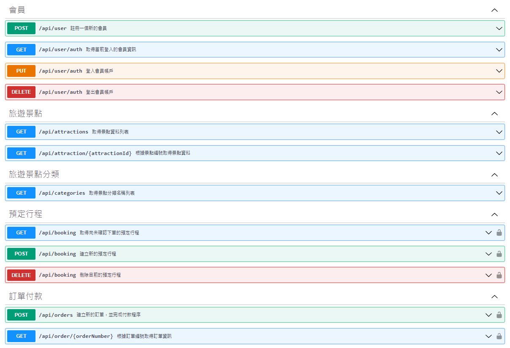
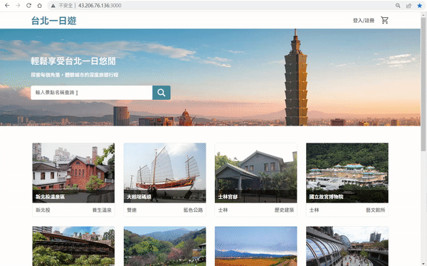
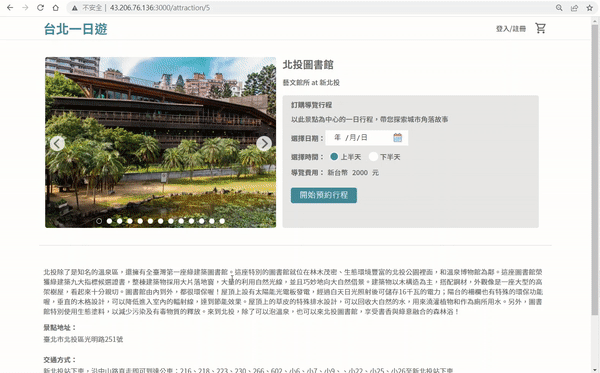
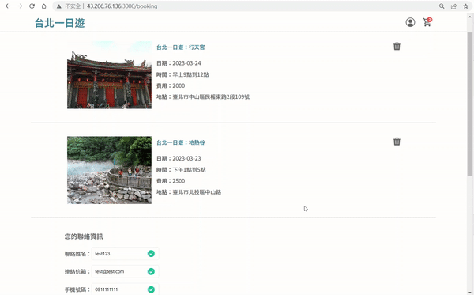
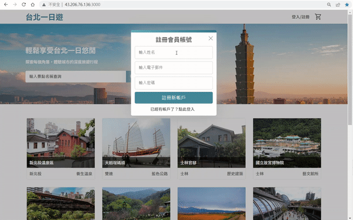

# Taipei-Day-Trip website

On the Taipei-day-trip website, you can search for famous attractions in Taipei, view detailed introductions, and book guided tours to help you explore Taipei and enjoy a wonderful day.

####:link: Website URL: http://43.206.76.136:3000/

####:man:Test Account

|    -     |       -       |
| :------: | :-----------: |
| Account  | test@test.com |
| Password |   testtest    |

####:credit_card:Test Credit Card

|      -      |          -          |
| :---------: | :-----------------: |
| Card Number | 4242 4242 4242 4242 |
| Valid Date  |        01/24        |
|     CCV     |         123         |

## Table of Contents

- [Technical Architecture](#-Technical-Architecture)
- [Front-end Technique](#-Front-end-Technique)
- [Back-end Technique](#-Back-end-Technique)
  - [Web Framework](#Web-Framework)
  - [Database](#Database)
  - [Cloud Service](#Cloud-Service)
  - [Third-party Payment](#Third-party-Payment)
- [Main features](#-Main-features)
  - [Infinite Scroll](#-Infinite-Scroll)
  - [Search Attractions](#-Search-Attractions)
  - [Slideshow](#-Slideshow)
  - [Third-party Payment (TapPay)](#-third-party-payment-tappay)
  - [Register and Login Validation](#-Register-and-Login-Validation)
  - [Member System](#-Member-System)
- [Contact](#Contact)

## ✿ Technical Architecture

<!--  -->

## ✿ Front-end Technique

- HTML/CSS/JavaScript
- AJAX
- Responsive Web Design(RWD)

## ✿ Back-end Technique

### Web Framework

- Python Flask
- RESTful API

### Database

- MySQL

### Cloud Service

- AWS EC2 (Ubuntu)

### Third-party Payment

- TapPay

## ✿ Main features

###:triangular_flag_on_post: Infinite Scroll

- Implement the Infinite Scroll effect using the JavaScript Intersection Observer API.

###:triangular_flag_on_post: Search Attractions

- Search for attractions based on categories or keywords.

###:triangular_flag_on_post: Slideshow

- Develop a Carousel Slider that enables effortless browsing of attraction images.

###:triangular_flag_on_post: Third-party Payment (TapPay)

- Connect to the TapPay API, verify the credit card credentials, and initiate the payment process.

###:triangular_flag_on_post: Register and Login Validation

- To ensure the correctness of data format, form validation is carried out in both the front-end and back-end.

###:triangular_flag_on_post: Member System

- Reset username or password and check historical orders.

## Contact

- :blush:Developer: Szu-Ping, Chen
- :mailbox:Email: rainbow801122@gmail.com
